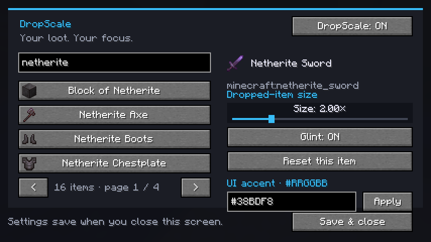

  

# DropScale

**Your loot. Your focus.**

Make the dropped items you care about easier to spot in a loot pile. Set individual sizes and glint effects through a searchable, dark UI.

**[Download DropScale 1.0.0](https://github.com/082-0/DropScale/releases/download/v1.0.0/DropScale-1.0.0-fabric-1.21.11.jar)** · [Release details](https://github.com/082-0/DropScale/releases/tag/v1.0.0) · [Creator](https://github.com/082-0)

## Pictures

Actual Minecraft screenshot. The selected Netherite Sword is set to 2x with glint enabled. This picture shows the settings UI; it does not show dropped-item gameplay.

## Features

| Feature | What you can do |
| --- | --- |
| Every registered item | Browse all nonempty item entries, including installed mods' items. |
| Search | Find items by localized name or registry ID, such as `minecraft:netherite_sword`. |
| Item icons | See the item icon and name while browsing. |
| Individual sizes | Set dropped-item sizes separately from **0.25x to 8x**. |
| Glint | Cycle between **Natural**, **On**, and **Off** for each item. |
| Master switch | Turn all DropScale overrides on or off with one button. |
| Custom accent | Enter any six-digit RGB hex color, such as `#38BDF8`. |
| Reset | Restore one item's original size and natural glint. |
| Saved settings | Keep your selections between sessions. |
| Size preview | Larger UI windows include a size preview; compact windows keep all controls. |
| Configurable shortcut | Open with **O**, or change the key in Minecraft's Controls menu. |

## Requirements

| Requirement | Version / scope |
| --- | --- |
| Minecraft Java Edition | **1.21.11 exactly** |
| Loader | **Fabric Loader 0.18.1 or newer** |
| Fabric API | **0.141.6+1.21.11 or newer compatible with 1.21.11** |
| Java | **21 or newer** |
| Installation side | **Client only**; the server does not need DropScale |

This download is not a Forge or NeoForge mod. Minecraft versions after 1.21.11 require separate builds and checks.

## Install

1. Install Fabric for Minecraft **1.21.11** in the launcher you use.
2. Install the matching **Fabric API** in that instance's `mods` folder.
3. Download `DropScale-1.0.0-fabric-1.21.11.jar` using the button above.
4. Put that JAR in the same `mods` folder and launch the instance.
5. Press **O** to open DropScale.

Keep one installed copy of DropScale. To rebind the shortcut, open **Options > Controls > Key Binds > DropScale > Open DropScale**.

## Customize your loot

1. Search for an item and select it. Use the arrow buttons to browse additional pages.
2. Drag its size slider. A focused slider also accepts arrow keys.
3. Choose **Natural**, **On**, or **Off** glint. Natural preserves its original enchantment appearance; Off suppresses glint for that dropped-item rendering.
4. Enter an accent color and click **Apply**. For example, blue `#38BDF8`, purple `#A78BFA`, or pink `#F472B6`.
5. Use **Save & close**, or press Escape, to save settings.

Changes apply while you adjust them. Settings are saved in your instance's **`config/dropscale.json`**. The **DropScale: ON/OFF** button disables or enables all overrides without discarding them.

## Limits and compatibility

- **Visual changes only.** Item collision boxes, pickup range, stack contents, and server behavior are unchanged.
- **Dropped items only.** Inventory and held-item sizes and glint keep their original behavior.
- **Size range: 0.25x–8x.** Very large models can overlap other loot or nearby blocks. Increasing their size does not expand Minecraft's visibility or render distance.
- **Glint appearance uses Minecraft's normal effect.** Resource packs may alter that effect. Custom glint colors, through-wall outlines, and glow effects are not included.
- **UI customization changes the accent color.** The charcoal background and layout are fixed in this release.
- **Items are configured by registry ID.** Different enchanted, named, or component variants of the same item share that item's rule.
- **The list includes registered nonempty items.** Air is excluded. An installed mod's items appear automatically, but compatibility with every custom item model is not guaranteed.
- **Compact UI windows omit the size preview.** Item icons and configuration controls remain available at the tested compact layout.
- **Minecraft 1.21.11 only.** Later versions, third-party renderer mods, shader setups, and existing mod packs have not been validated.

## What has been tested

| Check | Result |
| --- | --- |
| Java compilation and Fabric remapping | Passed |
| Development Minecraft 1.21.11 startup with Fabric API | Passed |
| Render-state mixin loading and scale storage | Passed |
| Searchable settings screen initialization | Passed |
| UI rendering and screenshot review | Passed |
| Settings saving and closing the screen | Passed |
| Dropped-item rendering during world gameplay | **Not yet verified** |
| Every third-party item model or mod pack | **Not verified** |

The screenshot above is from the actual client test. This first release is not a zero-bug guarantee.

## Troubleshooting

**The UI does not open:** confirm you launched the correct Fabric 1.21.11 instance and check the Open DropScale key binding for conflicts.

**Items still look normal:** check that the master switch is On and that you changed the correct item. Size 1x and Natural glint preserve normal visuals.

**A crash or rendering problem occurs:** disable DropScale or remove its JAR from the affected instance, then open an issue with the Minecraft version, Fabric Loader/Fabric API versions, mod list, reproduction steps, and the relevant `logs/latest.log` or crash report. Remove personal details before uploading logs.

## Download integrity

File: `DropScale-1.0.0-fabric-1.21.11.jar`  
Size: **24,060 bytes**  
SHA-256: `0119ef93da3da53609523c5f07629454c266aaf5920c92cb3c52c42bce3e143b`

The public JAR download was checked against the local compiled build and matched exactly.

## Distribution

The JAR contains compiled Java bytecode and mod resources. No Java source code or source ZIP is published here. GitHub may show automatic repository ZIP/TAR downloads; those contain this documentation and pictures, not the mod's Java source.

License: **CC0-1.0**.  
Website: **https://github.com/082-0**.