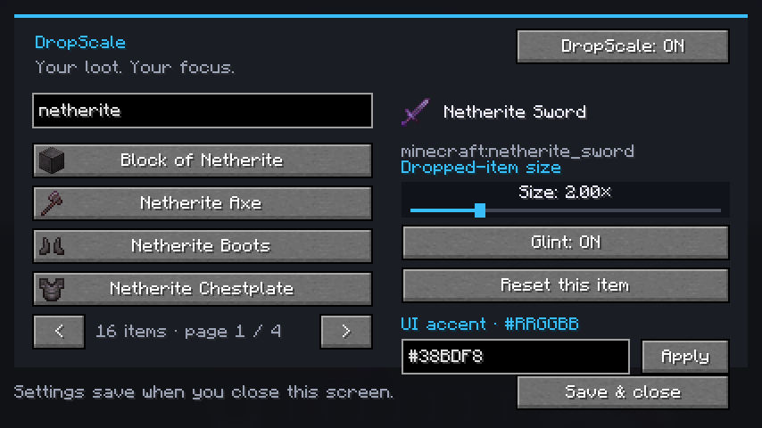
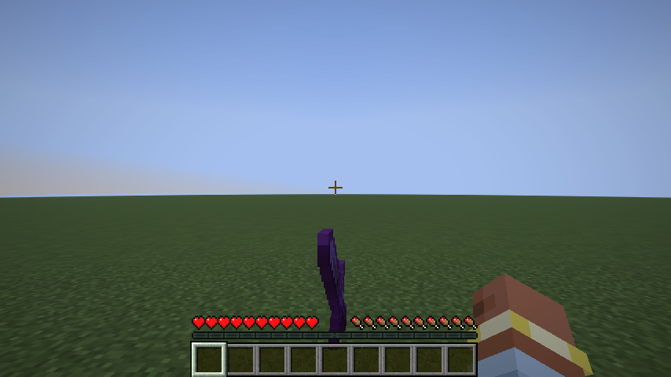

# DropScale

**Your loot. Your focus.** Make important dropped items stand out with individual size and glint settings.

## Download

| Mod | Download | Fabric API | Java |
| --- | --- | --- | --- |
| DropScale 1.21.11 | [Download](https://github.com/082-0/DropScale/releases/download/v1.0.0/DropScale-1.21.11.jar) | [0.141.6+1.21.11 or newer matching build](https://modrinth.com/mod/fabric-api/versions?g=1.21.11) | 21+ |
| DropScale 26.1 | [Download](https://github.com/082-0/DropScale/releases/download/v1.0.0-26.1/DropScale-26.1.jar) | [0.145.1+26.1 or newer matching build](https://modrinth.com/mod/fabric-api/versions?g=26.1) | 25+ |
| DropScale 26.1.1 | [Download](https://github.com/082-0/DropScale/releases/download/v1.0.0-26.1.1/DropScale-26.1.1.jar) | [0.145.4+26.1.1 or newer matching build](https://modrinth.com/mod/fabric-api/versions?g=26.1.1) | 25+ |
| DropScale 26.1.2 | [Download](https://github.com/082-0/DropScale/releases/download/v1.0.0-26.1.2/DropScale-26.1.2.jar) | [0.155.3+26.1.2 or newer matching build](https://modrinth.com/mod/fabric-api/versions?g=26.1.2) | 25+ |
| DropScale 26.2 | [Download](https://github.com/082-0/DropScale/releases/download/v1.0.0-26.2/DropScale-26.2.jar) | [0.161.0+26.2 or newer matching build](https://modrinth.com/mod/fabric-api/versions?g=26.2) | 25+ |
| DropScale 26.3 | [Download](https://github.com/082-0/DropScale/releases/download/v1.0.0-26.3/DropScale-26.3.jar) | [0.161.0+26.3 or newer matching build](https://modrinth.com/mod/fabric-api/versions?g=26.3) | 25+ |

**Use the JAR matching your exact Minecraft version.** Download one DropScale JAR, not every version.

Requires **[Fabric](https://fabricmc.net/)**: Loader **0.18.1+ for 1.21.11**, or **0.19.5+ for 26.x**. Install the matching **Fabric API** from the table. Client-side only; the server does not need DropScale. Forge and NeoForge are not supported.

## Pictures

### Configuration UI — Minecraft 26.3

### Dropped-item world test — Minecraft 26.3

These are actual Minecraft client screenshots. The test sword was configured at 2x with glint enabled.

## Install

1. Install [Fabric](https://fabricmc.net/use/installer/) for your Minecraft version.
2. Put matching **Fabric API** and **DropScale** JARs into that launcher's instance-specific `mods` folder.
3. Launch Minecraft and join a world.
4. Press **O** to open DropScale.

Change the shortcut in **Options > Controls > Key Binds > DropScale > Open DropScale**. Keep one installed DropScale JAR.

## Features and controls

| Feature | Controls |
| --- | --- |
| Search all items | Search localized names or IDs such as `minecraft:netherite_sword`. All registered nonempty items are listed, including modded items. |
| Item icons | Browse names and icons using the page arrows. |
| Individual sizes | Drag each item's size slider from **0.25x to 8x**; focused sliders also accept arrow keys. |
| Glint | Cycle **Natural / On / Off** for each item. Natural preserves original glint; Off suppresses it. |
| Master toggle | **DropScale: ON/OFF** enables or disables all overrides without discarding settings. |
| UI accent color | Enter six RGB hex digits, such as `#38BDF8`, and click **Apply**. |
| Per-item reset | **Reset this item** restores normal size and natural glint. |
| Saving | **Save & close** or Escape saves to your instance's `config/dropscale.json`. |
| Size preview | Larger UI windows include a size preview; compact windows retain controls and item icons. |

Settings take effect while you adjust them. Blue `#38BDF8`, purple `#A78BFA`, and pink `#F472B6` are example accent colors.

## Limits

- Visual changes apply only to dropped items. Pickup range, collision boxes, stack contents, and server behavior stay unchanged.
- Inventory and held items keep their original size and glint.
- Very large models can overlap other loot or blocks. Scaling does not expand render distance or make items visible through walls.
- Glint uses Minecraft's standard effect. Resource packs can change its appearance; custom glint colors and outlines are not included.
- Only the UI accent color is customizable. The charcoal background and layout are fixed.
- Enchanted, named, and component variants of the same registry item share one rule.
- Air is excluded. Modded entries appear automatically, but every custom model and third-party rendering mod has not been tested.
- On 26.x, join a world to browse item data. The title-screen UI shows a reminder instead of accessing unavailable data.
- Each JAR targets its exact labeled Minecraft version. Snapshots and future releases are not supported by these builds.

## Verification

**26.1, 26.1.1, 26.1.2, 26.2, and 26.3:** compiled separately and passed automated tests in temporary singleplayer worlds. Checks covered renderer-state extraction at 2x, master OFF restoring 1x, glint handling without modifying the original stack, a summoned dropped sword, UI search/rendering, saving, and closing. The test code is excluded from the published JARs.

**1.21.11:** compilation, Fabric remapping, development startup, render-state storage, UI search/rendering, and saving were checked. Its original build has not received the newer world test.

The reviewed 26.3 screenshots are shown above. Other mod packs, every possible item model, shaders, and all edge cases remain unverified; this is not a zero-bug guarantee.

## Troubleshooting

**Wrong version or missing dependency:** match the DropScale JAR, Minecraft version, Fabric Loader, Fabric API, and Java to the download table.

**O does not open the UI:** check that the right Fabric instance is running and rebind Open DropScale if another mod uses O.

**Items look normal:** check that the master switch is ON and that the correct item's rule differs from 1x / Natural.

**A crash or rendering problem occurs:** remove DropScale from the affected instance to isolate it. Open an issue with your Minecraft version, Loader/API versions, mod list, reproduction steps, and relevant `logs/latest.log` or crash report. Remove personal details from logs before posting.

## Distribution

Downloads contain compiled Java bytecode and mod resources. No Java source or source ZIP is published. GitHub's automatic repository archives contain documentation and pictures, not the mod's Java source. Each release lists its JAR's SHA-256 checksum.

Website: https://github.com/082-0  
License: **CC0-1.0**.
